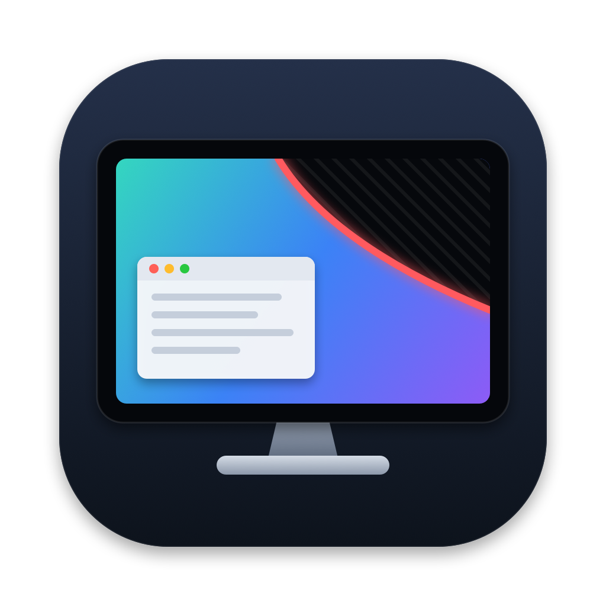
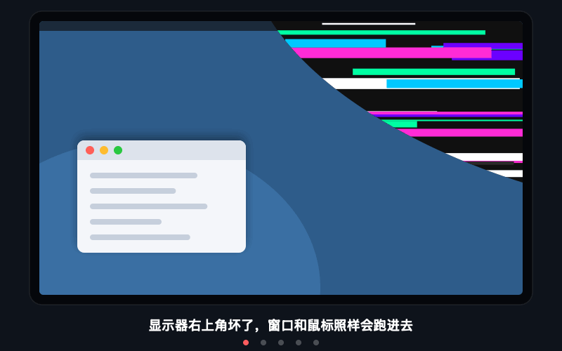

<p align="center">
  
</p>

<h1 align="center">DeadZone</h1>

<p align="center">
  把显示器上坏掉的区域"挖掉"，让一块局部损坏的屏幕继续像正常屏幕一样使用。<br>
  <sub>Carve out the broken part of your monitor on macOS — windows and the cursor treat it as if it doesn't exist.</sub>
</p>

<p align="center">
  
  <br><sub>示意动画 · Illustration</sub>
</p>

---

## 为什么

显示器局部坏了：角落花屏、中间一条竖线、一块黑斑、一道裂纹……其余部分完好，扔掉可惜。macOS 不支持"异形屏幕"，窗口会照样跑进坏掉的地方，鼠标进去了也看不见。

DeadZone 让坏区在使用上"不存在"：

- **窗口进不去**：拖进坏区的窗口松手即被推出，贴着坏区边缘摆放
- **最大化 / 全屏 = 顶着坏区最大化**：点绿色按钮、双击标题栏时，窗口铺满"避开坏区后最大的矩形"，不会真的进入系统全屏
- **鼠标进不去**：光标碰到边界会沿分界线平滑滑动，不会迷失在黑区里
- **黑色遮罩**：用纯黑盖住坏区，减少花屏干扰
- **任意形状、任意位置、任意数量**：角落、边缘、屏幕中间的斑块，或一条贯穿屏幕的坏线都可以
- **细线可以"跨过去"**：鼠标碰到窄的坏线会直接跳到另一侧，就像那条线不存在；还可以选择允许窗口跨过细线
- 按显示器分别记忆，改分辨率、拔插显示器后仍然有效
- **段位、成就与全球排名（估算）**：看看你的屏幕坏了多少、坚持用了多久，一键复制战绩卡片去炫耀

## 安装

需要 macOS 13 及以上，Apple 芯片和 Intel 均可。

### 从源码构建

需要 Xcode Command Line Tools（`xcode-select --install`）。

```bash
git clone https://github.com/prefect12/DeadZone.git
cd DeadZone
./build.sh --install
```

App 会被安装到 `~/Applications/DeadZone.app` 并自动启动。

### 使用下载的 Release

解压后把 `DeadZone.app` 放进"应用程序"。由于没有 Apple 开发者签名，首次打开需要在 Finder 中**右键 → 打开**，或执行：

```bash
xattr -dr com.apple.quarantine /Applications/DeadZone.app
```

## 使用

1. **授予辅助功能权限**：系统设置 → 隐私与安全性 → 辅助功能，打开 DeadZone。
   挪动其他应用的窗口、拦截鼠标都需要这个权限。
2. **打开主窗口**：点击 App 图标（或菜单栏图标 → 打开 DeadZone）进入主窗口，包含四个页面：
   - **屏幕**：每块屏幕的坏区缩略图、损坏面积和段位，点「圈选坏区」进入编辑
   - **圈选记录**：每次保存都会自动存一条记录，可随时「应用」回去
   - **成就与战绩**：段位、全球排名估算、成就墙、复制战绩卡片
   - **设置**：遮罩、窗口避让、细线跨越、鼠标拦截、开机启动
3. **标记坏区**：在「屏幕」页点「圈选坏区」进入编辑界面。坏区里常常什么都看不见，所以都是在**看得见的一侧**沿边缘操作。有三种工具：

   | 工具 | 快捷键 | 适合 | 用法 |
   | --- | --- | --- | --- |
   | 多边形 | `1` / `P` | 任意形状的斑块、角落 | 沿边缘逐点单击，或按住拖动描边；双击、回车或右键完成 |
   | 矩形 | `2` / `R` | 规整的矩形区域 | 按住拖出矩形 |
   | 线条 | `3` / `L` | 竖线、横线、裂纹 | 沿线点击，两端点在屏幕边缘即可贯穿；滚轮或 `[` `]` 调整宽度 |

   - 靠近屏幕边缘的点会自动吸附到边上，靠近角落会吸附到角上
   - 可以画多块；右键点击已有坏区可删除，⌘Z 撤销
   - 贯穿全屏的绿色十字线：鼠标进了黑区也能从可见部分判断它的位置
   - 没在画的时候：回车保存并退出，Esc 放弃修改
4. 多块屏幕：编辑中按 `Tab` 保存并切换到下一块屏幕。
5. 菜单栏图标可能被刘海挡住，这时**再次打开 DeadZone.app** 即可进入主窗口。

菜单栏中可以单独开关黑色遮罩、窗口避让、允许窗口跨过细线（≤40pt）、鼠标拦截，以及开机自动启动。

## 段位、成就与排名

菜单栏 → **成就与战绩…**

**段位**按损坏面积（坏区占整块屏幕的比例）划分：

| 损坏面积 | 段位 |
| --- | --- |
| < 5% | 🔍 坏点而已 |
| 5% – 15% | 💧 洒洒水啦 |
| 15% – 30% | 🩹 小伤不下火线 |
| 30% – 50% | 💪 身残志坚 |
| 50% – 70% | 🏯 半壁江山 |
| 70% – 90% | 🧮 勤俭持家小能手 |
| ≥ 90% | 🪦 这就别用了吧 |

**成就**共 18 个，例如：用坏屏幕 10 天「你真是个人才」、30 天「一个月了还没换？」、365 天「年度钉子户」、鼠标撞墙 10000 次「撞了南墙也不回头」、两块屏幕都有坏区「难兄难弟」……解锁时会在屏幕上弹出提示（自动避开坏区）。

**全球排名是估算，仅供娱乐。** 总体是"屏幕坏了还在继续用的人"。公开调查给出的量级：约 18% 的美国人正在用碎屏手机，碎屏后约 34% 选择继续使用（[YouGov](https://yougov.com/en-us/articles/48503-what-do-american-consumers-do-when-their-phone-screens-crack)）；约 20–30% 的显示器至少有一个坏点，而 ISO 13406-2 Class II 本身就允许少量坏点（[Whirlpool 论坛统计](https://forums.whirlpool.net.au/archive/317317)）。据此假设坚持用坏屏的人绝大多数只是坏点或小裂纹，大面积坏区极少，并在 log(损坏面积) 上设定锚点插值（见 `main.swift` 中的 `Ranking`）。欢迎提供更好的数据来改进这个模型。

所有统计只保存在本机，不联网。

## 工作原理

| 功能 | 实现 |
| --- | --- |
| 坏区形状 | 多边形 / 带宽度的线条，以屏幕比例坐标存于 `UserDefaults`，以显示器 UUID 区分 |
| 黑色遮罩 | 与坏区同形状、屏保层级、鼠标穿透的无边框窗口 |
| 窗口避让 | 形状栅格化为 4pt 网格并合并成矩形；`CGWindowList` 找出与之重叠的窗口，经 Accessibility API 平移或缩小，选改动最小的方案 |
| 最大化 | 在可用区域内求避开坏区的最大矩形；系统全屏会被退出并改为该矩形 |
| 鼠标拦截 | 独立线程上的 `CGEventTap`，在事件送达前修正光标：窄坏区沿运动方向跳过，大坏区投影到最近边缘贴边滑动 |

所有逻辑都在单个文件 [`main.swift`](main.swift) 中，不依赖任何第三方库，**不联网，不收集任何数据**。

## 已知限制

- macOS 无法真正改变屏幕形状，DeadZone 是在行为层面模拟
- 如果菜单栏在这块屏幕上，坏区里的状态栏图标仍会被挡住；建议把主显示器设为另一块屏幕
- 正在拖动窗口的过程中，窗口可以暂时进入坏区，松手后才会被推出
- 这块屏幕上的系统全屏（包括网页视频全屏）都会被改为"顶着坏区最大化"
- 屏幕中间一条贯穿的坏线会把屏幕分成两半，窗口默认只能待在一侧；可在菜单中允许窗口跨过细线

## 开发

```bash
./build.sh            # 构建到 build/DeadZone.app（Universal）
./build.sh --install  # 构建、安装并启动
swift scripts/make_icon.swift Resources/icon.png   # 重新生成图标 PNG
swift scripts/make_demo.swift Resources/demo.gif   # 重新生成 README 示意动画
```

使用 ad-hoc 签名，并把指定要求固定为 bundle id，重新编译后不需要重新授予辅助功能权限。

## License

[MIT](LICENSE)
